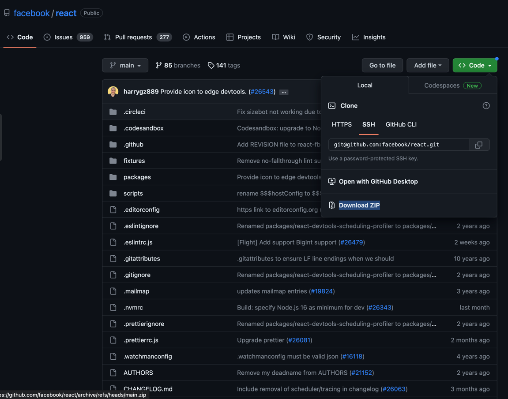

# Here are some reusable github action for any project

## Scalingo

Deploy an app to scalingo, from the tar.gz url.

Usage exemple :

1. In your repository, at the root add file respecting the following structure : 
`.github/workflow/deploy-to-scalingo.yml`

With the following content :

```yml
on:
  push:
    branches:
      - master # your production branche, could also be main or production

jobs:
  deploy:
    uses: gip-inclusion/reusable-github-actions/.github/workflows/deploy-to-scalingo-from-github-targz.yml@main
    with:
      appName: "your-app-name-on-scalingo"
      region: "the-region" # if not provided, will default to "osc-fr1"
      targzUrl: "https://github.com/link-to-the-targz-you-want-to-deploy/archive/refs/heads/master.tar.gz"
    secrets:
      SCALINGO_API_TOKEN: ${{ secrets.SCALINGO_API_TOKEN }}
```

If you are looking for the tar.gz url of your repository, is should be there, replacing : `.zip` with `.tar.gz`


2. Get a SCALINGO_API_TOKEN from scalingo console, and add it in your github project secrets (settings > security > actions)

3. Next time you push the branch, the workflow will run
   